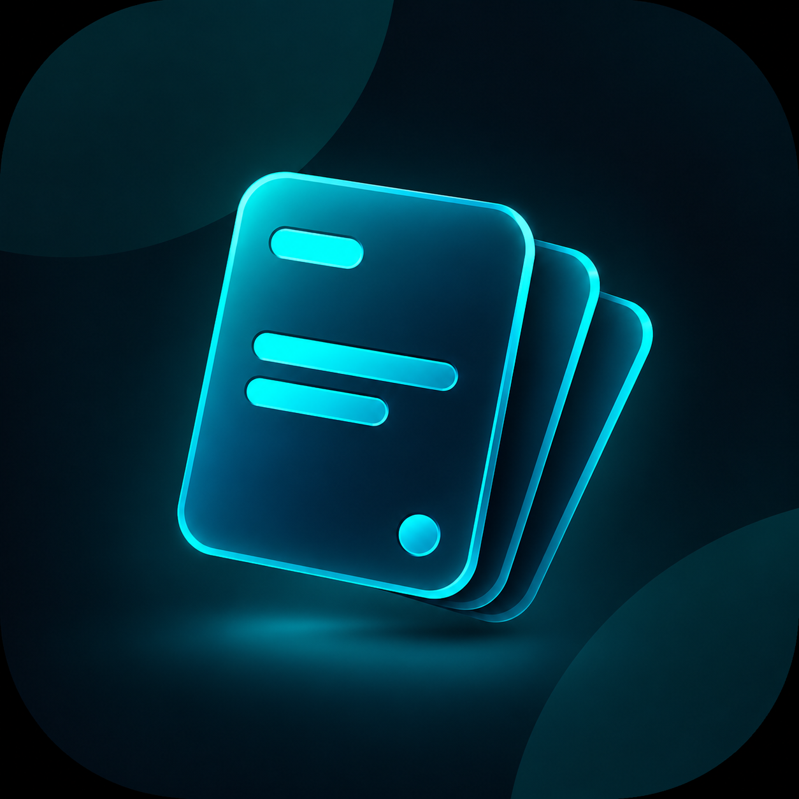
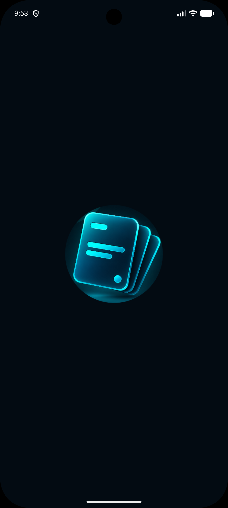
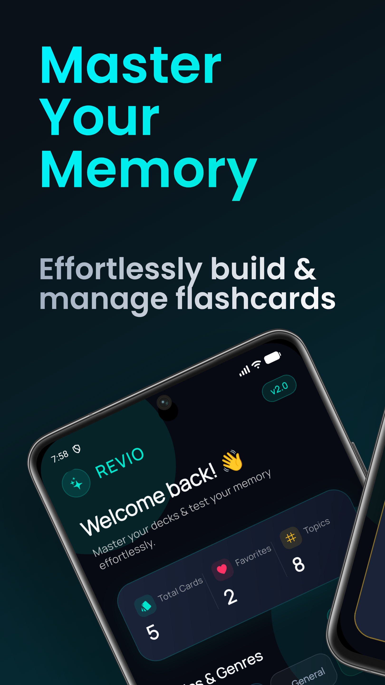
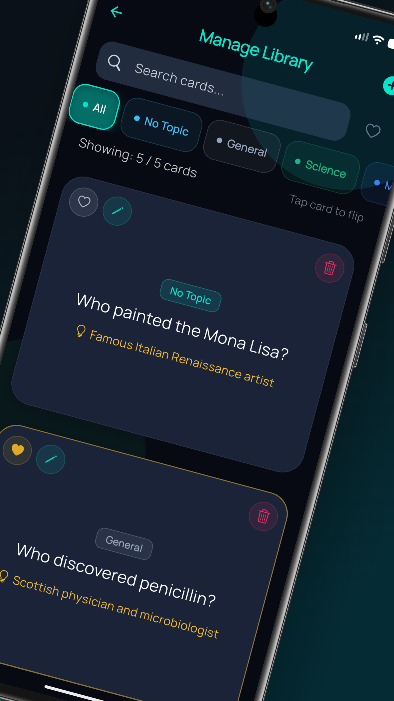
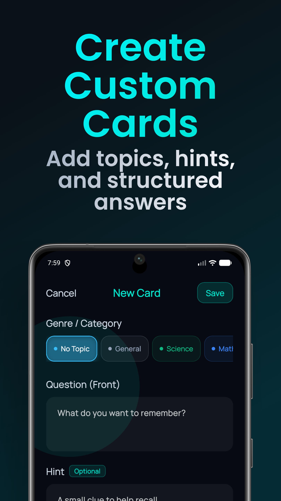
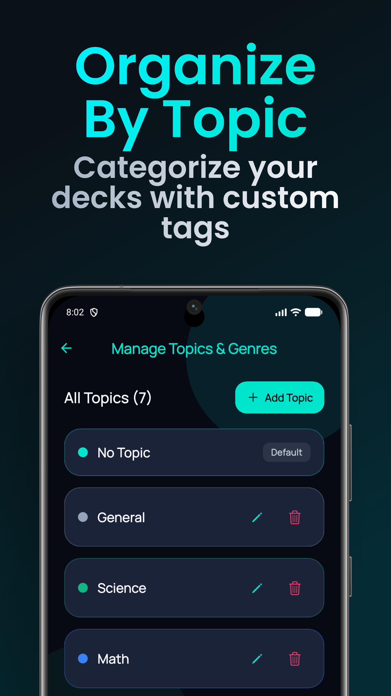
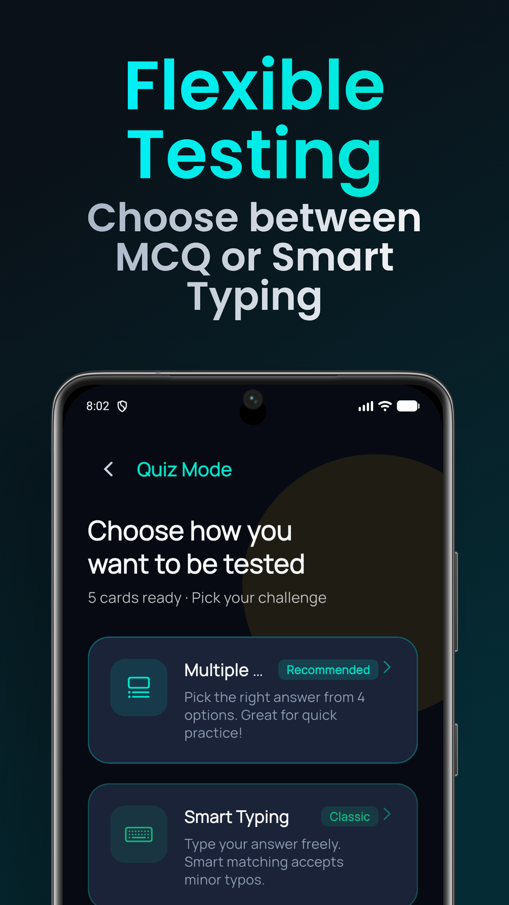
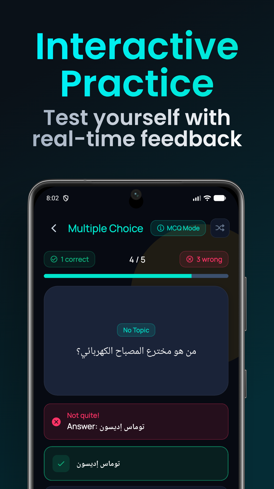
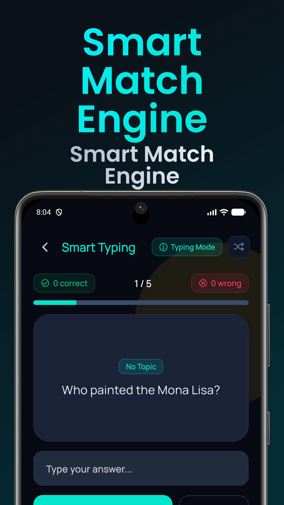
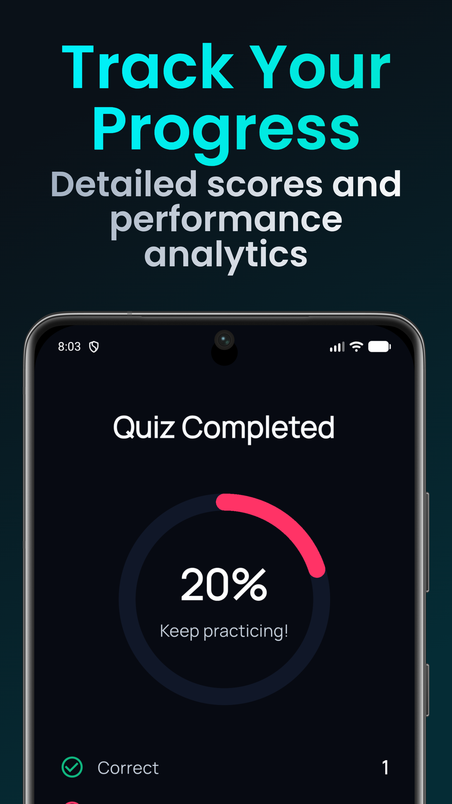

<div align="center">

<h1>🃏 Revio</h1>

<p>
  <a href="https://flutter.dev">
    
  </a>
  <a href="https://dart.dev">
    
  </a>
  <a href="LICENSE">
    
  </a>
  <a href="https://flutter.dev">
    
  </a>
  <a href="https://play.google.com/store/apps/details?id=com.ahmed.revio&hl=en_US">
    
  </a>
</p>

<p><strong>A dark-themed flashcard app built with Flutter: organize cards by topic, flip to reveal answers, and test yourself with Multiple Choice or Smart Typing quizzes that forgive typos. Offline-first with Hive CE, Cubit state management, and a feature-based architecture.</strong></p>

<p>
  <a href="https://play.google.com/store/apps/details?id=com.ahmed.revio&hl=en_US"><strong>📱 Get it on Google Play</strong></a>
</p>

<p>
  <a href="#-features">✨ Features</a> •
  <a href="#-screenshots">📷 Screenshots</a> •
  <a href="#-technical-stack">🔧 Stack</a> •
  <a href="#-architecture">🏗 Architecture</a> •
  <a href="#-getting-started">🚀 Getting Started</a> •
  <a href="#-author">👤 Author</a>
</p>

</div>

---

## 📖 Table of Contents

- [Demo Video](#-demo-video)
- [Overview](#-overview)
- [Features](#-features)
- [Screenshots](#-screenshots)
- [Technical Stack](#-technical-stack)
- [Architecture](#-architecture)
- [Smart Answer Matching](#-smart-answer-matching)
- [Dependencies](#-dependencies)
- [Getting Started](#-getting-started)
- [Known Limitations](#-known-limitations)
- [Roadmap](#-roadmap)
- [Contributing](#-contributing)
- [License](#-license)
- [Author](#-author)

---

<div align="center">

## 🎬 Demo Video

**[▶️ Watch Revio in Action on YouTube Shorts](https://youtube.com/shorts/FsG1XUAbmDY?si=lvngji7Uz-EKRROJ)**

</div>

---

## 📖 Overview

**Revio** (v2.0.0) is a Flutter flashcard application for learning and memorization. Cards live in a local Hive CE database, so everything works offline. Version 2 adds topic management, a library with search and filters, two quiz modes, a typo-tolerant answer matcher, and a fully redesigned midnight-and-teal interface.

It is a personal portfolio project built to practice Clean Architecture, Cubit/BLoC state management, and local persistence in a real, shippable app.

---

## ✨ Features

### 🏠 Home Dashboard
- Live stats: **Total Cards**, **Favorites**, and **Topics**
- Topic chips that jump straight into the library filtered by that topic
- Quick actions: **Start Quiz Challenge**, **My Library**, **New Card**

### 🃏 Flashcards
- Flip-card animation to reveal the answer (tap to flip in the library)
- Category badge on every card, with a color per topic
- Optional hint on the front of the card
- Mark cards as **favorites**, **edit** them from a bottom sheet, or **delete** them with a confirmation dialog

### 🗂 Library
- Search across question, answer, and hint
- Filter by topic and by favorites only
- Live "Showing X / Y cards" counter
- Add cards from a bottom sheet without leaving the library
- Swipe a card to delete, with a confirmation step

### 🏷 Topics
- Built-in topics: **No Topic**, **General**, **Science**, **Math**, **Language**
- Create custom topics, rename topics (cards update automatically), and delete topics (their cards move to **No Topic**)
- **No Topic** is the protected default and can't be renamed or deleted

### 🎯 Quiz
- **Multiple Choice**: pick the right answer from up to 4 options (needs at least 2 cards)
- **Smart Typing**: type your answer; typos and short forms are accepted
- Live correct / wrong counters and a progress bar
- Show or hide the card's hint during a question
- Skip a card in typing mode
- Shuffle toggle (restarts the quiz)
- Instant feedback, including the correct answer when you miss
- Results screen with an animated score ring, correct / wrong / skipped counts, time taken, and **Play Again**

### ✍️ Adding Cards
- Question, optional hint, answer, and topic picker
- Form validation with clear messages
- Discard protection when leaving with unsaved text
- Cards accept Arabic content as well as English (see the quiz screenshots)

### 🔧 Technical Highlights
- **Feature-based Clean Architecture** with Cubit per feature
- **Offline-first** persistence with Hive CE, with a stream-based cards list that updates the UI automatically
- **Custom `AnswerMatcher`** with exact, numeric, partial, and Levenshtein fuzzy matching
- **Custom-painted** score ring (`CustomPainter`) with animated progress
- **Responsive** layouts via `flutter_screenutil`
- Fade page transitions and per-route `BlocProvider`s in a central `AppRouter`
- Reusable helpers: snackbars, spacing, navigation extension, background glow variants per screen
- Native splash screen and launcher icons (configured for Android and iOS)

---

<div align="center">

## 📷 Screenshots

</div>

<div align="center">

### 📱 Launch & Home

| App Icon | Splash Screen | Home Dashboard |
|:--------:|:-------------:|:--------------:|
|  |  |  |
| Revio on your home screen | Native dark splash | Stats, topics, and quick actions |

### 🗂 Library & Cards

| Manage Library | Create Custom Cards | Organize by Topic |
|:--------------:|:-------------------:|:-----------------:|
|  |  |  |
| Search, filter, flip, edit, delete | Topic, hint, and answer fields | Add, rename, and delete topics |

### 🎯 Quiz Experience

| Quiz Mode | Multiple Choice | Smart Typing | Results |
|:---------:|:---------------:|:------------:|:-------:|
|  |  |  |  |
| Choose how to be tested | Real-time feedback | Fuzzy answer matching | Score ring and stats |

> **Note:** Some screenshots use demo data to showcase specific features.

</div>

---

<div align="center">

## 🔧 Technical Stack

</div>

<div align="center">

| Component | Technology | Purpose |
|:---------:|:----------:|:-------:|
| **Framework** | Flutter | Cross-platform UI |
| **Language** | Dart (SDK ^3.12.1) | Core development |
| **State Management** | flutter_bloc ^9.1.1 | Cubit pattern |
| **Local Database** | hive_ce ^2.19.3 | Offline card and topic storage |
| **Hive Flutter** | hive_ce_flutter ^2.3.4 | Hive initialization for Flutter |
| **Responsive UI** | flutter_screenutil ^5.9.3 | Screen-adaptive sizing |
| **Card Animation** | flip_card ^0.7.0 | Flip effect |
| **Icons** | cupertino_icons ^2.0.0 | iOS-style icons |
| **Code Generation** | hive_ce_generator ^1.11.2, build_runner ^2.15.1 | TypeAdapter and registrar generation |
| **Splash Screen** | flutter_native_splash ^2.4.8 | Native launch screen |
| **Launcher Icons** | flutter_launcher_icons ^0.14.4 | App icon generation |
| **Project Rename** | rename ^3.1.0 | Bundle ID and app name |
| **Design** | Material 3 | UI foundation |
| **Font** | Manrope | Typography |

</div>

---

<div align="center">

## 🏗 Architecture

</div>

### 📁 Project Structure

```
lib/
├── main.dart                             # Entry point, Hive init, root providers
├── hive_registrar.g.dart                 # Generated adapter registry
│
├── core/                                 # App-wide shared layer
│   ├── constants/
│   │   └── app_constants.dart            # Route names, default topic
│   ├── helpers/
│   │   ├── answer_matcher.dart           # Exact / numeric / partial / fuzzy matching
│   │   ├── category_manager.dart         # Topic CRUD over Hive
│   │   ├── routing_extension.dart        # Navigation helpers on BuildContext
│   │   ├── snackbar_helper.dart          # Success / error / info snackbars
│   │   └── spacing.dart                  # Responsive spacing widgets
│   ├── routing/
│   │   └── app_router.dart               # Route generation, fade transitions, BlocProviders
│   ├── theming/
│   │   ├── app_colors.dart               # Midnight obsidian & teal palette
│   │   └── app_styles.dart               # Manrope text styles
│   └── widgets/
│       ├── app_background_glow.dart      # Glow backgrounds per screen variant
│       └── genre_chip_picker.dart        # Topic chips with "Add topic" dialog
│
└── features/
    ├── add_new_card/
    │   ├── logic/                        # add_card_cubit.dart, add_card_state.dart
    │   └── ui/
    │       ├── add_new_card_screen.dart
    │       └── widgets/                  # app_text_form, appbar_body, card_form_back_scope
    ├── cards/                            # Shared card data + widgets
    │   ├── data/
    │   │   ├── models/                   # card_model.dart, card_model.g.dart
    │   │   └── repo/                     # cards_repo.dart (Hive CRUD + watch stream)
    │   ├── logic/                        # get_all_cards_cubit.dart, get_all_cards_state.dart
    │   └── ui/widgets/                   # card_face, flash_card, confirm_message
    ├── home/
    │   └── ui/
    │       ├── home_screen.dart
    │       └── widgets/                  # cards_number_container, hero_quiz_card,
    │                                     # home_header, home_hero_greeting, quick_action_card
    ├── quiz/
    │   ├── logic/                        # quiz_cubit.dart, quiz_state.dart
    │   └── ui/
    │       ├── quiz_screen.dart
    │       ├── quiz_results_screen.dart
    │       └── widgets/                  # quiz_app_bar, quiz_mode_selection_view,
    │                                     # quiz_mode_selector, quiz_options_view,
    │                                     # quiz_progress_bar, typing_quiz_input
    ├── review/
    │   ├── logic/
    │   │   ├── delete_card/              # delete_card_cubit.dart, delete_card_state.dart
    │   │   └── edit_card/                # edit_card_cubit.dart, edit_card_state.dart
    │   └── ui/
    │       ├── review_cards_screen.dart
    │       └── widgets/                  # add_card_modal_bottom_sheet, card_search_bar,
    │                                     # edit_card_bottom_sheet, library_empty_state
    └── topics/
        └── ui/
            └── manage_topics_screen.dart
```

### 🔄 Data Flow

```
   UI (Screens/Widgets)  ──▶  Cubit (State)  ──▶  CardsRepo  ──▶  Hive CE (local)
            ▲                                          │
            └──────────── watchCards() stream ◀────────┘
```

`GetAllCardsCubit` is provided at the app root and subscribes to `CardsRepo.watchCards()`, so any add, edit, delete, or favorite change refreshes the home dashboard, library, and quiz automatically. Feature cubits (add, edit, delete, quiz) are provided per route in `AppRouter`.

### 🧠 State Management

Cubit-based, with explicit state classes per feature:

| Cubit | States |
|:------|:-------|
| `AddCardCubit` | Initial → Loading → Success / Error |
| `EditCardCubit` | Initial → Loading → Success / Error |
| `DeleteCardCubit` | Initial → Loading → Success / Error |
| `GetAllCardsCubit` | Initial → Loading → LoadedSuccess / Error (stream-based) |
| `QuizCubit` | ModeSelection → InProgress → Completed |

### 💾 Data Model

```dart
@HiveType(typeId: 0)
class CardModel extends HiveObject {
  @HiveField(0) final String id;
  @HiveField(1) final String? category;
  @HiveField(2) final String front;      // Question
  @HiveField(3) final String? hint;      // Optional hint
  @HiveField(4) final String back;       // Answer
  @HiveField(5) final bool? isFavorite;
  @HiveField(6) final int? difficulty;
  @HiveField(7) final DateTime? createdAt;
}
```

Hive boxes opened at startup: `flash_cards_box` (cards), `custom_categories_box` (user topics), and `deleted_core_categories_box` (built-in topics the user removed).

---

## 🧪 Smart Answer Matching

`AnswerMatcher` normalizes both answers (lowercase, trim, collapse whitespace), then checks in order:

| Order | Match type | Rule |
|:-----:|:-----------|:-----|
| 1 | **Exact** | Normalized strings are equal |
| 2 | **Numeric** | First number in each answer is the same (digits, or the words zero to ten) |
| 3 | **Partial** | One answer contains the other (both longer than 2 characters) |
| 4 | **Fuzzy** | Levenshtein similarity of at least 0.75 |

Anything else is marked wrong. Multiple Choice mode submits the chosen option through the same matcher.

---

## 📦 Dependencies

```yaml
dependencies:
  flutter:
    sdk: flutter
  cupertino_icons: ^2.0.0
  flutter_native_splash: ^2.4.8
  flutter_launcher_icons: ^0.14.4
  rename: ^3.1.0
  flutter_screenutil: ^5.9.3
  flip_card: ^0.7.0
  hive_ce: ^2.19.3
  hive_ce_flutter: ^2.3.4
  flutter_bloc: ^9.1.1

dev_dependencies:
  flutter_test:
    sdk: flutter
  flutter_lints: ^6.0.0
  build_runner: ^2.15.1
  hive_ce_generator: ^1.11.2
```

---

## 🚀 Getting Started

### 📋 Prerequisites

| Requirement | Version |
|:-----------:|:-------:|
| Flutter SDK | A release that ships Dart ^3.12.1 |
| Dart SDK | ^3.12.1 |

### ⚙️ Installation

```bash
# 1. Clone the repository
git clone https://github.com/ahmed-el-bialy/Revio.git
cd Revio

# 2. Install dependencies
flutter pub get

# 3. (Optional) Regenerate Hive adapters. Generated files are already committed.
dart run build_runner build --delete-conflicting-outputs

# 4. Run the app
flutter run

# Build for production
flutter build apk --release      # Android
flutter build ios --release      # iOS
```

### 🎨 Regenerate Icons and Splash

```bash
dart run flutter_launcher_icons
dart run flutter_native_splash:create
```

---

## ⚠️ Known Limitations

| Issue | Details |
|:------|:--------|
| Quiz covers the whole library | Quizzes always use every card; there is no per-topic quiz yet |
| Numeric matching is shallow | Only the first number is compared and number words stop at ten, so "3 apples" and "3 oranges" both match |
| Partial matching is lenient | An answer that contains, or is contained in, the correct one is accepted |
| Skip is typing-only | Multiple Choice mode has no skip button |
| No quiz history | Results are shown once per session and not stored |
| No spaced repetition | The `difficulty` field exists in the model but is not used yet |
| No import / export | Cards cannot be backed up or shared |
| No cloud sync | Data lives on a single device |
| English-only interface | Card content can be Arabic, but UI text is not localized |

---

## 🗺 Roadmap

- [ ] Per-topic and favorites-only quizzes
- [ ] Persistent quiz history and statistics
- [ ] Spaced Repetition System (using the `difficulty` field)
- [ ] Smarter numeric matching
- [ ] Import / Export cards (JSON / CSV)
- [ ] Cloud sync (Firebase)
- [ ] Unit and widget tests
- [ ] Localization (Arabic, English, French)
- [ ] Improved accessibility (screen reader support)

---

## 🤝 Contributing

Contributions are welcome!

1. **Fork** the repo
2. **Create** a branch: `git checkout -b feature/your-feature`
3. **Commit**: `git commit -m 'Add awesome feature'`
4. **Push**: `git push origin feature/your-feature`
5. **Open** a Pull Request

---

## 📄 License

This project is licensed under the **MIT License**. See [LICENSE](LICENSE) for details.

---

<div align="center">

## 👤 Author

**Ahmed El-Bialy**
*Flutter Developer*

<p>
  <a href="https://www.linkedin.com/in/ahmedel-bialy/">
    
  </a>
  <a href="mailto:ah.elbialy.dev@gmail.com">
    
  </a>
  <a href="https://github.com/ahmed-el-bialy">
    
  </a>
  <a href="https://youtube.com/@ahmedel-bialy">
    
  </a>
</p>

<p>
  📧 <strong>Email:</strong> ah.elbialy.dev@gmail.com<br>
  📱 <strong>WhatsApp:</strong> +20 10 2212 1573<br>
  🌐 <strong>Portfolio:</strong> <a href="https://ahmedel-bialy.framer.website/">ahmedel-bialy.framer.website</a>
</p>

---

### ⭐ Star this repo if you found it helpful!

**Built with 💙 by Ahmed El-Bialy**

</div>
